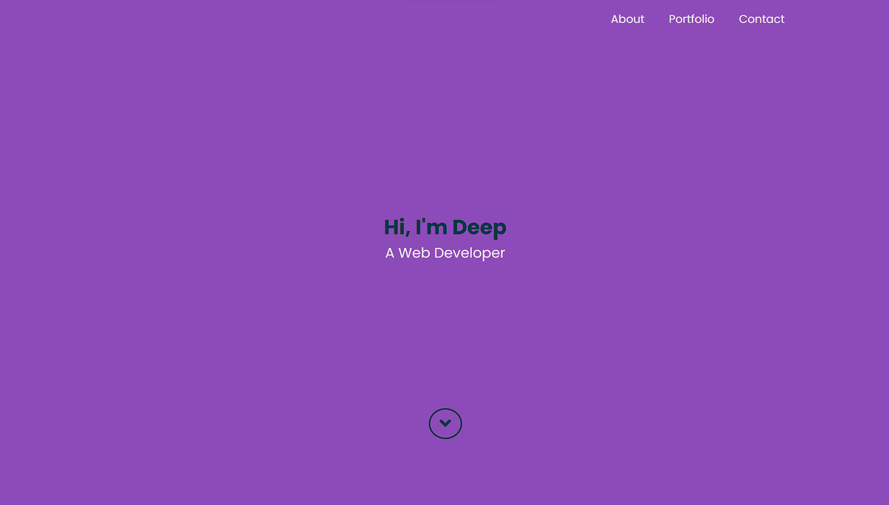
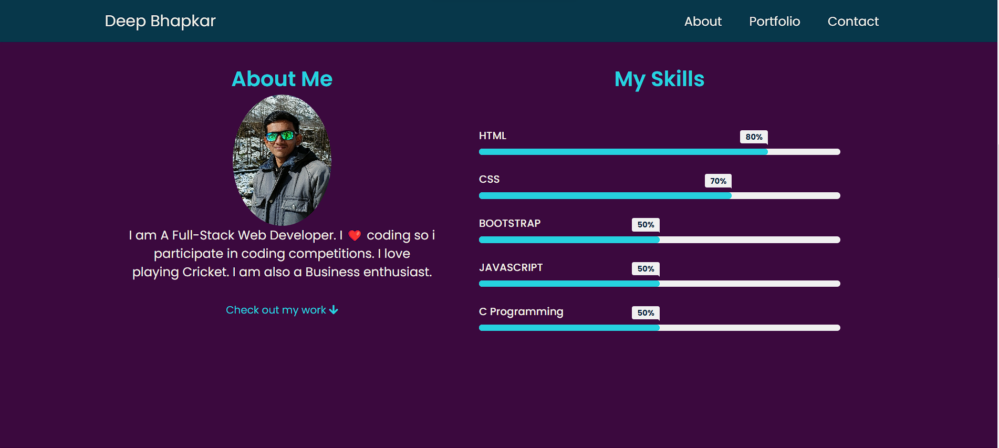
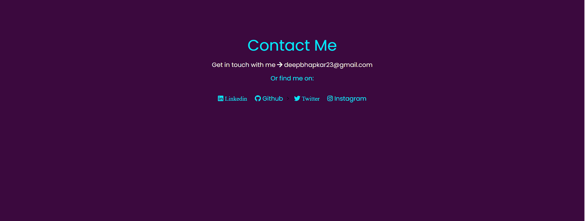

# CodSoft2
PortFolio Level 1 Task 2
 
<b>PORTFOLIO</b>

Welcome to My PORTFOLIO website. This repository contains code for my Portfolio,
which shocases my work and my skills.

<b>Demo Webpage Link:</b> https://deepbhapkar.github.io/CodSoft2/

<b>Technologies Used:</b>

The PortFolio Website utilizes the following technologies:

<b>HTML</b>: Markup language for structuring the web pages.

<b>CSS</b>: Styling language for visually enhancing the UI.

<b>Javascript</b>: It enhances the interactivity and user experience of websites

Webpage looks like => 

This is a responsive web page: 

Thus Functional on<b> Mobiles</b> and<b> Tablets </b>as well.

